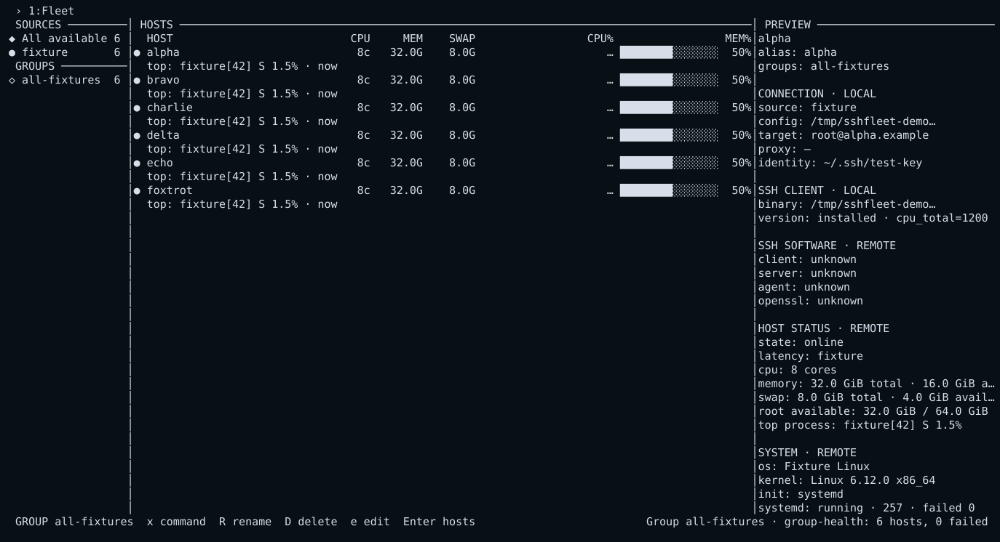
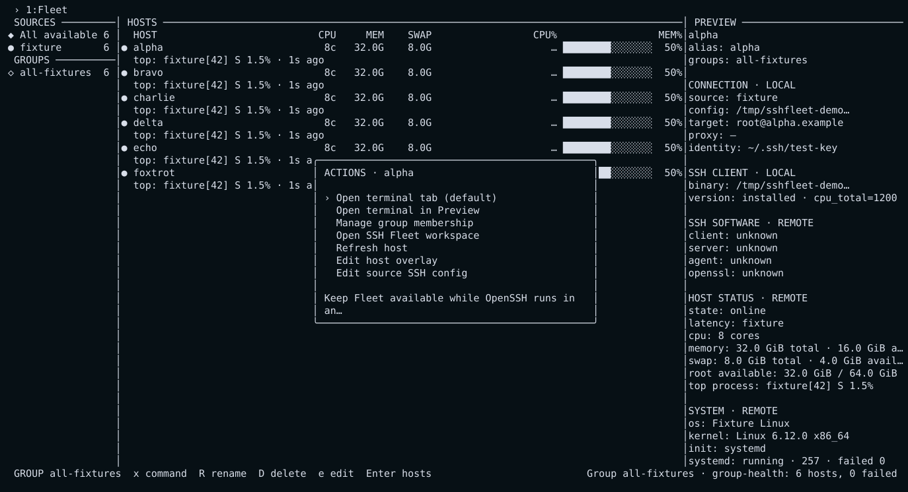
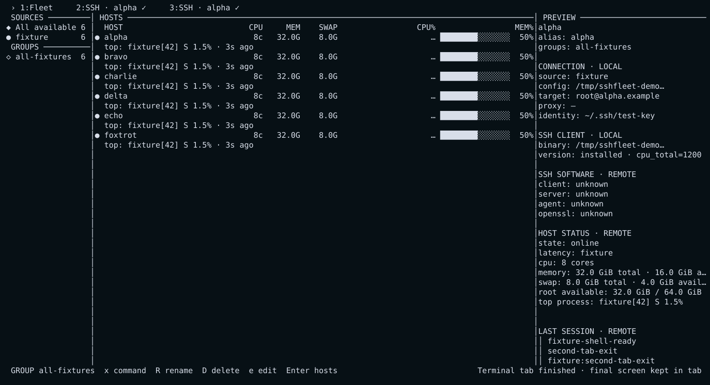
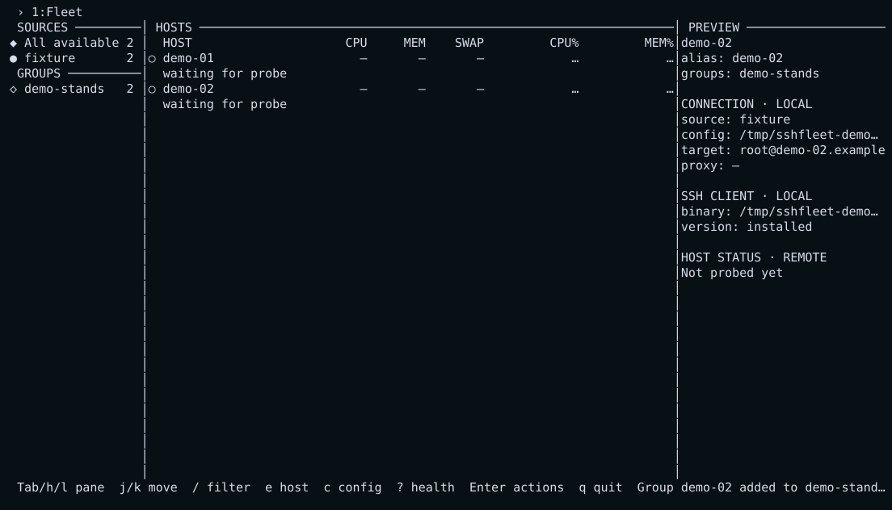

# SSH Fleet Console

`sshfleet` — быстрая локальная TUI-консоль для SSH-флота: источники и группы слева,
главная таблица узлов по центру, объяснимый Preview справа.

Она читает привычный OpenSSH config, параллельно и безопасно опрашивает Linux
узлы, открывает обычный или встроенный терминал и помогает работать с десятками
и сотнями SSH-алиасов без собственного SSH-стека.

> Первый публичный stable-релиз —
> [`v0.1.0`](https://github.com/ponomarev-prime/sshfleet-console/releases/tag/v0.1.0).
> Текущая разработка ведётся в `dev`; проверенные SemVer-релизы выпускаются
> только из защищённой `main` через полный regression и ручное подтверждение
> environment `release`.
> Граница clean public history и правила privacy-safe screenshots сохранены в
> [гайде публикации](docs/publishing.md).

```text
 SOURCES        HOSTS — основной рабочий столбец                 PREVIEW
 All available  ● api-01      8c  31.3G  8.0G  CPU% ███  27%   CONNECTION · LOCAL
 user           ● db-01      16c  63.8G  8.0G  MEM% ████ 41%   SSH CLIENT · LOCAL
 shared           top: postgres[1842] · 3s ago                  HOST STATUS · REMOTE
 GROUPS         ○ git.example  Git access                       SSH SOFTWARE · REMOTE
 production
                                                                SYSTEM · REMOTE
```



<details>
<summary>Ещё три проверенных сценария интерфейса</summary>

### Меню действий выбранного узла



### Несколько независимых терминальных вкладок



### Private cross-source group



</details>

Все изображения созданы отдельным fixture-only PTY pipeline. Они не содержат
реальные fleet names, IP-адреса, usernames, credentials или домашние пути.

## Почему SSH Fleet Console

- **OpenSSH остаётся источником истины.** Подключения выполняет системный `ssh`:
  работают ключи, `ssh-agent`, `ProxyJump`, `Include` и `known_hosts`.
- **HOSTS — главный экран.** Видны CPU cores, RAM, swap, загрузка CPU/RAM,
  наиболее активный процесс и возраст данных; Preview разделяет локальные и
  удалённые сведения. Dtop-style `█/░` bars сохраняют заполненную и свободную
  части даже на нейтрально выделенной строке.
- **Несколько уровней источников.** Встроенный `~/.ssh/config`, дополнительные
  доверенные OpenSSH configs, строгий TOML inventory, локальные и удалённые
  подписанные age-bundles.
- **Секреты не живут в TOML.** Пароли, bearer tokens и passphrases хранятся в
  Secret Service/KWallet и поступают OpenSSH через отдельный AskPass-процесс.
- **Отказоустойчивость проверяется настоящим терминалом.** Unit/model, race,
  PTY, снимки экранов, age/SSHSIG/TLS и Docker/OpenSSH E2E запускаются одной
  командой и оставляют артефакты.

Проект распространяется по [Apache License 2.0](LICENSE). Атрибуции и точные
тексты лицензий библиотек, входящих в core-бинарь, находятся в
[THIRD_PARTY_NOTICES.md](THIRD_PARTY_NOTICES.md).

## Быстрый старт

Полностью проверенный runtime сейчас — Linux. Нужны OpenSSH client и Go 1.25+
для сборки из исходников. Core также собирается нативно на macOS и Windows;
healthcheck честно отключает ещё не реализованные ConPTY и native credential
store actions, вместо Unix-эмуляции или падения всего приложения.

```sh
git clone https://github.com/ponomarev-prime/sshfleet-console.git
cd sshfleet-console
./install.sh
sshfleet healthcheck
sshfleet
```

Установщик не использует `sudo`, не меняет shell rc и создаёт основную команду
`~/.local/bin/sshfleet`. Она одинаково запускается из `sh`, Bash, Zsh и Fish и
не зависит от текущего каталога. Короткий alias `sf` создаётся только когда это
имя свободно; существующая команда никогда не перезаписывается. `sshf` временно
сохраняется как совместимый legacy-alias до `v1.0.0`.

Если репозиторий уже клонирован:

```sh
make install-user
sshfleet --version
sshfleet
```

Полный режим дополнительно собирает закреплённые `lf`, `dtop`, `nvim` и `bat`,
проверяет их и готовит временный remote workspace bundle:

```sh
./install.sh --full
sshfleet healthcheck --strict
```

Optional actions появляются только при наличии соответствующей capability.
Без `nvim`, `lf`, `dtop` или bundle основная навигация и SSH продолжают работать.

## Первые сценарии

Обычный запуск автоматически загружает `~/.ssh/config` как источник `user`:

```sh
sshfleet
```

Посмотреть итоговый inventory без TUI и без подключения:

```sh
sshfleet --no-probe --list
```

Проверить изолированный дополнительный OpenSSH config, не читая пользовательский:

```sh
sshfleet --no-user-ssh-config --ssh-config lab=~/.ssh/lab.conf
```

Подключить строгий inventory только на этот запуск:

```sh
sshfleet --no-user-ssh-config --inventory stands=~/inventory/stands.toml
```

Сохранить источник через безопасный интерактивный мастер:

```sh
sshfleet source add
```

Подробные, готовые к копированию сценарии находятся в
[руководстве пользователя](docs/user-guide.md), включая группы, terminal tabs/Preview
terminal, редактирование конфигов, Git endpoints, host-key repair и portable
tools.

## Управление TUI

| Клавиша | Действие |
|---|---|
| `Tab`, `h/l`, `←/→` | сменить панель |
| `j/k`, `↑/↓` | выбрать строку |
| `g/G`, `Home/End` | перейти в начало/конец |
| `/`, `Esc` | фильтр / закрыть или очистить |
| `Enter` | применить source или открыть контекстное меню host |
| `n` в Sources | создать private group |
| `m` на Host | добавить/убрать host из группы |
| `R`, `D`, `e` на Group | переименовать, удалить или открыть fragment в редакторе |
| `e` на Host | изменить private host overlay |
| `c` | изменить главный application TOML |
| `x` | выбрать команду для выделенной `@ group`, увидеть план, подтвердить |
| `r` | обновить probes |
| `Shift+K` | проверить и затем backup-first исправить changed host key |
| `?` | application healthcheck, пути tools и фактические ширины UI |
| `Alt+1…9` | выбрать вкладку напрямую: `1` — Fleet, `2` — первая сессия |
| `Ctrl+N` / `Ctrl+P` | следующая / предыдущая вкладка |
| `Ctrl+G` | вернуться в постоянную вкладку Fleet |
| `Ctrl+D` в terminal tab | немедленно закрыть вкладку и вернуться во Fleet |
| `Ctrl+]` в terminal tab | запросить закрытие; повторное нажатие подтверждает live close |
| `q`, `Ctrl+C` во Fleet | выйти |

`Alt+1…9` — основной прямой способ. SSH Fleet Console также принимает
`Ctrl+1…9`, но это сочетание требует modifyOtherKeys/Kitty keyboard protocol и
часто резервируется внешним terminal emulator. Гарантированный fallback —
`Ctrl+N/P` и `Ctrl+G`.
Bracketed paste передаётся активному terminal tab/Preview одним событием и не
разбирается как горячие клавиши SSH Fleet Console.
В живой terminal tab обычная `q` передаётся вложенной программе. После
завершения активной shell/SSH-сессии интерфейс автоматически возвращается во
Fleet, а её финальный экран остаётся во вкладке с `✓`.
`Ctrl+D` — локальное быстрое закрытие: вкладка удаляется сразу, а остановка PTY
завершается в фоне. Это работает и когда вложенная программа не понимает EOF.

Меню `Enter` адаптируется к типу узла. Для Linux это новая terminal tab по умолчанию,
terminal in Preview, единый временный SSH Fleet workspace во вкладке со всеми bundled
tools, refresh и редактирование. Для Git
endpoint — безопасный `ssh -T` access check. Для changed host key — сначала
проверяемый repair flow.

Обычные `Open terminal tab` и `Open terminal in Preview` намеренно сохраняют
исходные remote `PATH` и набор программ. Чтобы получить временные `lf`, `nvim`,
`dtop` и `bat`, выберите именно `Open SSH Fleet workspace`.

## Что уже работает

| Область | Возможности |
|---|---|
| Inventory | OpenSSH aliases/Includes, strict TOML, host overlays, keyboard-managed cross-source groups |
| Sources | local OpenSSH, restricted TOML, signed+age local bundle, authenticated HTTPS remote bundle |
| Observability | bounded concurrent Linux probe, capacity, utilization bars, SSH/system/container metadata |
| Sessions | постоянная Fleet + независимые SSH/local/container PTY tabs, embedded Preview PTY/VT, bounded sanitized tail |
| Operations | Git access check, group command plans, backup-first host-key repair, config editing |
| Tools | owned-before-system resolution, `nvim → vim → nano`, `lf` + bat/less paging, optional portable workspace |
| Security | OpenSSH host verification, Secret Service AskPass, strict schemas, signature/hash/expiry/rollback checks |
| Delivery | embedded provenance, SemVer release gate, Linux amd64/arm64 core archives, checksums |
| Quality | unit/model, race/vet, PTY menu traversal, screenshots, Docker sshd, workspace E2E |

Полная матрица поведения, ограничений и статуса — в
[каталоге функциональности](docs/features.md).

## Конфигурация

Главный файл — `$XDG_CONFIG_HOME/sshfleet/config.toml`, обычно
`~/.config/sshfleet/config.toml`. TOML имеет приоритет; YAML не является
каноническим форматом.

```toml
version = 1

[terminal]
# Только локальная рабочая станция; SSH/container shell имеют свои policy.
default_shell = "auto"
shell_args = []

[app]
refresh_interval = "10s"
connect_timeout = "6s"
load_user_ssh_config = true
probe_enabled = true
editor_priority = ["nvim", "vim", "nano"]
groups_dir = "~/.config/sshfleet/groups.d"

[app.containers]
enabled = true
runtimes = ["docker", "podman"]
refresh_interval = "2s"
include_stopped = false
shell_policy = "first_available"
shell_priority = ["/bin/bash", "/bin/ash", "/bin/sh"]

[app.ui]
sources_width_percent = 10
preview_width_percent = 24
host_column_percent = 30

[[sources]]
name = "lab"
kind = "ssh_config"
path = "~/.ssh/lab.conf"

[[sources]]
name = "workstation"
kind = "local_config"
path = "~/.config/sshfleet/local.toml"

[[groups]]
name = "production"
members = ["user:api-01"]
match = ["lab:prod-*"]

[[command_presets]]
name = "uptime"
argv = ["uptime"]
timeout = "15s"
max_concurrent = 4
```

`HOSTS` получает оставшуюся ширину; боковые панели не могут вытеснить его.
`max_concurrent` по умолчанию равен `2 × GOMAXPROCS`. Неизвестные поля и
неоднозначные настройки завершают запуск ошибкой.

Private groups из TUI хранятся по одной в
`$XDG_CONFIG_HOME/sshfleet/groups.d/*.toml` (обычно
`~/.config/sshfleet/groups.d`) и никогда не переписывают source. На host нажмите
`m` либо `Enter` → `Manage group membership`; точный формат fragment и правила
`members`/`match` приведены в [справочнике конфигурации](docs/configuration.md#cross-source-groups).

`[terminal]` задаёт локальную оболочку для trusted direct localhost. Приоритет:
`--shell`/repeatable `--shell-arg` → TOML → OS auto-detection. Effective path и
origin видны в `?`/`healthcheck` и Preview localhost; явная отсутствующая shell
не заменяется другой молча. Аргументы всегда передаются отдельным argv.

`local_config` — отдельный доверенный локальный файл. Он может описать direct
localhost с выбранными shell/argv/working directory или локальный sshd с
настраиваемым port; удалённый source не может выбирать executable на рабочей
машине. Docker/Podman containers обнаруживаются динамически и получают
read-only inspect Preview: runtime context/endpoint, immutable ID, image,
platform, health, entrypoint/cmd, restart policy, mounts, networks и ports.
Running target имеет меню `shell / Preview / logs / refresh`; stopped/distroless
target остаётся видимым без shell. Состояния runtime (`empty`, `denied`,
`unavailable`, `partial`, `stale`) объясняются в интерфейсе. SSH-ключи и agent
не передаются.

```sh
sshfleet --no-user-ssh-config --local-config workstation=~/.config/sshfleet/local.toml
sshfleet source add --type local --name workstation --path ~/.config/sshfleet/local.toml
```

Все поля, допустимые диапазоны, пути, precedence, CLI flags, source fragments,
credentials, identities, groups и presets описаны в
[справочнике конфигурации](docs/configuration.md). Полный пример —
[sshfleet.example.toml](sshfleet.example.toml).

## Модель безопасности

SSH Fleet Console не реализует SSH и не обходит проверку host keys.

- OpenSSH configs считаются доверенным локальным кодом: `ProxyCommand`,
  `KnownHostsCommand` и `Match exec` могут запускать программы.
- Restricted inventory использует закрытую неисполняемую схему и соединяется с
  `ssh -F /dev/null`; удалённый `ssh_config` запрещён.
- Пароли, токены, private key bytes и passphrases не допускаются в TOML, argv,
  logs, Preview, session history и fixtures.
- Remote source принимается только по HTTPS, затем проверяются SSHSIG, hash,
  source/revision/expiry/rollback, и только после этого age расшифровывается в
  памяти. Cache содержит ciphertext.
- Changed host key никогда не исправляется автоматически: сначала независимая
  проверка fingerprint, затем уникальный backup и atomic edit.

Полный trust model и потоки данных: [docs/security-model.md](docs/security-model.md).
Сообщить об уязвимости: [SECURITY.md](SECURITY.md). Отложенное усиление:
[docs/security-backlog.md](docs/security-backlog.md).

## Версии и релизы

```sh
sshfleet --version
sshfleet version
sshfleet version --json
```

Development build выглядит как `dev-14061d49c195`; суффикс `+dirty` означает,
что в бинарь попали незакоммиченные изменения. Stable release использует строгий
SemVer tag `vMAJOR.MINOR.PATCH`, например `v0.1.0`.

SemVer прост: `MAJOR` — несовместимые изменения, `MINOR` — новые совместимые
возможности, `PATCH` — совместимые исправления. До `v1.0.0` политика проекта
разрешает продуктовые изменения в `MINOR`, а `PATCH` оставляет для fixes и
security hardening. Подробно: [глоссарий](docs/glossary.md#semver) и
[процесс релиза](docs/releasing.md).

Stable tag создаётся только из текущего `main` после полного regression на том
же SHA, проверки provenance, public audit, archive metadata и checksums.

## Проверки

Одна команда полного прогона:

```sh
make regression
```

Она запускает unit/model, race, vet, build/install, version/release contracts,
coverage, все source/security tests, action/group menus, настоящий PTY,
визуальный screenshot traversal, toolchain и Docker host-key/workspace E2E.
Отдельный настоящий PTY-проход запускает саму `make regression` из `sh`,
`bash`, `zsh` и `fish`; CI и release gate требуют наличия и успеха всех четырёх
оболочек.
Результат всегда остаётся в `.artifacts/regression-<timestamp>/`: manifest,
логи, coverage, binaries и terminal screenshots сохраняются даже при ошибке.
Unit и coverage stages имеют двухминутный watchdog, а race stage —
четырёхминутный: зависший subprocess завершается со stack trace вместо
десятиминутного молчания.

Более короткие циклы:

```sh
make test          # Go unit/model/PTY tests
make test-shell-entrypoints # запуск regression entrypoint из sh/bash/zsh/fish
make test-public-screenshots # fixture-only и privacy-checked screenshots
make test-licenses  # Apache-2.0 + exact production dependency notices
make test-menu     # все контексты и строки Enter menu
make test-sources  # inventory, age, SSHSIG, TLS, remote cache
make test-version  # provenance, SemVer и release gate
make test-docker   # настоящий sshd и host-key rotation/repair
make cover         # per-package и общее statement coverage
make check         # tests + vet + build + toolchain locks
```

Архитектура тестов и ручные acceptance paths описаны в
[каталоге функциональности](docs/features.md#проверяемость) и
[manual toolchain checks](docs/manual-toolchain-checks.md).

## Документация

- [Руководство пользователя](docs/user-guide.md) — интерфейс и сценарии работы.
- [Справочник конфигурации](docs/configuration.md) — TOML, CLI, paths и precedence.
- [Каталог функциональности](docs/features.md) — что реализовано и как проверяется.
- [Модель безопасности](docs/security-model.md) — trust boundaries и secrets flow.
- [Глоссарий](docs/glossary.md) — SemVer, fleet, source, overlay, probe и другие термины.
- [Цели и сценарии](docs/project-goals-and-scenarios.md) — продуктовый контракт.
- [Изолированный запуск](docs/manual-isolated-config.md) — custom source без `~/.ssh/config`.
- [Релизы](docs/releasing.md) и [семейство репозиториев](docs/repositories.md).
- [Companion toolchain](tools/README.md) — `lf`, `dtop`, `nvim`, `bat` и bundle.

## Репозитории SSH Fleet

SSH Fleet — семейство, а не монорепозиторий:

- `sshfleet-console` — этот Go TUI и команда `sshfleet`;
- `sshfleet-web` — будущий браузерный клиент;
- `sshfleet-hub` — будущий API, authentication, fleet subscriptions и доставка
  подписанных encrypted inventories.

Компоненты имеют независимые релизы и trust boundaries и интегрируются только
через версионируемые схемы и API.
